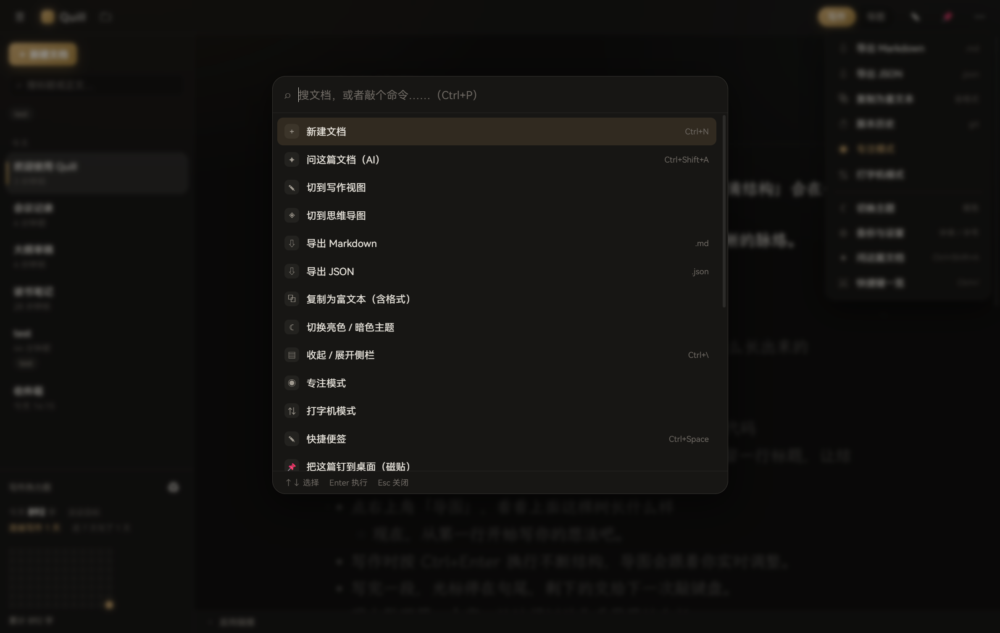
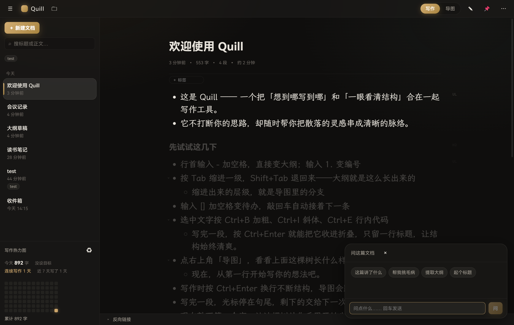

# Quill（羽笔）

一个类 Effie 的写作工具：**沉浸式写作 + 大纲层级 + 一键思维导图**，本地优先，文档用 git 做版本管理。

> **开发版** — 功能已成形、日常写作可用，但接口与数据格式仍可能调整，暂不建议存放不可替代的重要资料。安装包见 [Releases](../../releases)。


| 命令面板 · `Ctrl + P` | 问这篇文档 · `Ctrl + Shift + A` |
|---|---|
|  |  |

<sub>亮色主题等更多截图见 [`docs/screenshots`](docs/screenshots)（截图脚本：`shoot-screenshots.mjs`）</sub>

## 现在能做什么

### 写作手感

| 能力 | 说明 |
|---|---|
| 沉浸写作 | 无工具栏干扰、720px 正文栏、大留白、可切亮/暗主题 |
| 大纲即正文 | `- ` / `1. ` / `[] ` 即时转换，Tab 缩进、Shift+Tab 退级 |
| 大纲折叠 | 有子列表的条目左侧出现三角，点击折叠/展开（状态随编辑位置映射，不会错位） |
| 块拖拽排序 | 抓住行首点阵手柄拖动，渐变落点线指示，可跨层级重排 |
| 斜杠命令 | 任意位置敲 `/` 唤起块类型菜单（11 种），带过滤与键盘导航 |
| 专注模式 | 只亮当前段落，其余淡出到 26% |
| 打字机模式 | 光标锁定视口偏上位置，滚动平滑跟随 |
| 待办列表 | 可勾选、可嵌套、输入 `[] ` 直接生成 |
| 表格 | GFM 表格（`/表格` 或斜杠菜单），加列删行都是活的；写进 `.md` 就是标准 `\| a \| b \|` 语法 |
| 代码块高亮 | 代码块按语言着色（常用语言全支持），配色跟纸墨主题一套 |
| 插入媒体 | 截图直接 `Ctrl+V` 贴进来、文件从资源管理器拖进来、或 `/图片` `/视频` 选文件；媒体存进仓库 `assets/`，`.md` 里就是普通的 `` |
| 图片调尺寸 | 点中图片，拖右下角手柄改宽度（拖动时显示 px 读数），双击手柄恢复自适应。调过尺寸的写成 ``，没调的仍是纯 Markdown |
| 富文本 | 标题 / 粗体 / 斜体 / 行内代码 / 高亮 / 引用 / 代码块 / 分隔线 |
| 外观自定义 | 正文字体（霞鹜文楷 / Inter / 系统字体…）、字号、行距；正文、便签、磁贴三处同步 |
| 阅读模式 | `F9` 转只读通读：收起侧栏、工具栏淡出、正文放宽到 880px，右下角留一个退出徽标免得被困住 |
| 禅模式 | `F11` 窗口切真全屏 + 藏掉标题栏、侧栏、状态栏，只剩正文；文档信息和标签平时收着，鼠标进正文才浮现。用别的方式退出全屏（Win+↓ / Esc）会自动跟着退出禅模式 |
| 批注 | 选中文字 → 浮条上的「＋ 批注」→ 写评语。正文里是淡底 + 下划线的标记，点它打开右侧面板并定位。**批注不进 `.md`**：存在 `.quill-meta.json`（跟星标/标签一起，照样跟着 git 走），正文改动后按原文片段自动重新定位 |

### AI 助手（可选）

三件事，**只有第一件默认关闭** —— 因为它会自己触发、按次花钱；另外两件是你点了才动，随时可用。

**① 行内续写（默认关）**：停手一会儿，模型顺着上文给一小段**灰色提示**：`Tab` 接受、`Esc` 忽略 —— 不要就等于什么都没发生，正文一个字符都不会被动。`Alt + /` 可以随时手动要一次。

- **兼容 OpenAI 接口**：DeepSeek / OpenAI / Ollama / LM Studio / 各种中转，填地址、Key、模型名即可
  —— 模型名不用背：点输入框右边的箭头有常见候选，点「从接口获取」还能直接拉这个地址支持的
  **真实模型列表**（`GET /models`），点一个就填进去；中转给的自定义名字照旧可以手打
- **② 选中一段 → 润色 / 精简 / 扩写 / 纠错 / 换语气 / 译英**：结果先流式列在浮条里，
  点「采纳」才真正改文档（走正常事务，`Ctrl+Z` 能撤销），不满意可以「重来」
- **③ `Ctrl + Shift + A` 问这篇文档**：摘要、挑毛病、提取大纲、起标题，
  答案可一键插到文末，也能复制走
- **API Key 只写在本机配置目录**（`%APPDATA%\com.quill.write\ai.json`），**绝不进文档仓库** —— 那个仓库是要推到远程的
- 走 **SSE 流式**，提示是一个字一个字长出来的

续写这条的省钱限制是认真的（每敲几个字就请求一次，不设限会很吓人）：

| 限制 | 值 |
|---|---|
| 触发时机 | 停手 N 毫秒后（默认 800ms，可调 300–2500） |
| 触发条件 | 光标前至少 6 个字、无选中、不在输入法组词中 |
| 去重 | 同一个前缀不重复请求 |
| 长度 | 默认 160 tokens（可调，见下），提示词要求 1～2 句 |
| 上下文 | 只发光标前最多 1500 字 + 文档标题 |

#### 可调参数

「设置 → AI 助手」里能改三项长度、一个创意度和一段额外要求，**拖完即时生效，不用点保存**：

| 参数 | 默认 | 范围 | 管什么 |
|---|---|---|---|
| 续写长度 | 160 | 64–512 | 行内续写一次生成多少 |
| 改写长度 | 2400 | 256–8192 | 选中文本重写的上限 |
| 回答长度 | 2000 | 256–8192 | 文档问答的上限 |
| 创意度 | 0.70 | 0–1.5 | 越低越稳、越高越活 |
| 额外写作要求 | 空 | — | 追加到三条系统提示词末尾，比如「少用四字成语」 |

长度按 token 算，中文大致**一个字一个 token**。回复撞上上限时接口会回一个
`finish_reason: length`，界面据此标出「结果可能没写完」并指出去调哪一项 ——
不会让你对着半句话猜是模型不行还是设小了。

### 组织与检索

| 能力 | 说明 |
|---|---|
| 文档模板 | 空白 / 日记 / 大纲草稿 / 读书笔记 / 会议记录 / 周报 |
| 每日笔记 | `Ctrl + D` 直接跳到「今天」，还没有就按「日记」模板建一篇 |
| 命令面板 | `Ctrl + P` 模糊搜文档 + 顺手跑命令（新建 / 主题 / 导出 / 钉磁贴 / 设置…） |
| 全文搜索 | 标题 + 正文内容（正文命中会显示上下文片段） |
| 双向链接 | 正文里写 `[[标题]]` 互相引用，点一下跳过去 |
| 反向链接 | 正文底部的折叠条告诉你「谁引用了我」，带上下文片段，可点击跳转 |
| 标签 | 编辑器里回车即加，侧栏 chip 一键筛选，文件改名时标签自动跟随 |
| 回收站 | 删除先移进 `.trash/`，可恢复 / 彻底删除 / 清空 |
| 收藏 | 星标置顶分组 |
| 写作热力图 | 侧栏底部 12 周 × 7 天，按当日字数分 4 级亮度 |
| 目标与连续天数 | 「今天 320 / 500 字」进度条 + 「连续写作 N 天」；目标在设置里调，拖到 0 就是不设 |
| 字数统计 | 字数 / 段数 / 预计阅读时长，保存状态呼吸提示 |

### 思维导图

- 大纲一键转导图（d3-hierarchy 算布局，自绘 SVG + 贝塞尔连线）
- **按文档结构分层**：标题（H1/H2/H3）是分支，列表项挂在对应标题下 —— 一篇多节的文章，
  每节的大纲都在图上（标题节点加重描边，正文段落淡显）
- 连线生长动画、节点逐个淡入
- 滚轮缩放（跟随鼠标）、拖动平移
- **点节点跳回正文**：切回写作视图并把光标精准落到那一段
- 导出 **PNG（2 倍图）** 与 **矢量 SVG**

### 数据与版本（核心）

- **一篇文章 = 一个纯 Markdown 文件**，没有私有数据库、没有专有格式
- **每次保存自动 git commit**：`更新《标题》`，改名走 rename（历史不断）
- 版本历史抽屉：列提交 → 预览旧版本内容 → 一键回滚（回滚本身也记一笔提交）
- 仓库位置：`%USERPROFILE%\Documents\Quill`，点顶栏 🗀 直接用资源管理器打开
- 导出 **Markdown / HTML（单文件）/ PDF / JSON**
- **导出 PDF 走系统打印**：打印机里选「Microsoft Print to PDF」——出的是矢量文本，中文不糊、还能选中复制（不是拿 canvas 截图拼的）
- **从文件夹批量导入 Markdown**：选个文件夹就整批搬进来（Obsidian / Notion 导出的就是这种），同名自动加序号、整批只算一次提交
- **复制为富文本**：带格式复制，粘到公众号 / Word 里标题、列表、表格都还在
- 元数据（星标 / 标签）存 `.quill-meta.json`，统计存 `.quill-stats.json`，都跟着 git 走

### Markdown 支持范围

目标很明确：**`.md` 进 Quill 转一圈出来，内容一个字都不能少**。
逐项实测见 `verify-md-syntax.mjs`，现在 72 项：60 项字节级无损，12 项规范化为等价写法，**0 项丢失**。

**完整支持，往返一致：**

标题 H1–H6、段落、引用与嵌套引用、无序 / 有序 / 任务列表与嵌套、代码块（带语言高亮；
内容里含围栏时自动加长围栏，不会把块从中间截断）、GFM 表格、分隔线、链接、
图片（可带宽度）、视频、粗体 / 斜体 / 删除线 / 行内代码 / 高亮、硬换行、双链 `[[ ]]`、
**YAML frontmatter**（原样留在文件头 —— Obsidian / Hugo / Jekyll 写的元数据不会被抹掉）。

**能读，但会被规范化成等价写法：**

| 你写的 | 存下来变成 |
|---|---|
| `* 项目` 或 `+ 项目` | `- 项目` |
| `1) 第一` | `1. 第一` |
| `***` 分隔线 | `---` |
| `_斜体_` | `*斜体*` |
| `- [X]` | `- [x]` |
| Setext 标题 | ATX 标题 `# …` |
| 四空格缩进代码块 | 围栏代码块 |
| 标题紧邻正文 | 中间补一个空行 |

都是等价写法，内容与语义不变。而且改一次就稳定，不会每次保存都抖。

**当普通文字保留，不渲染：** 脚注、定义列表、HTML 标签、LaTeX 公式、单波浪线删除线。
**内容不会丢**，往返后仍是原样的字面文本，只是不按那种语法渲染。

**已知差异：** 列表项里嵌的代码块，保存后会从列表项里提出来成为独立块。
内容与缩进都在，只是不再挂在那个列表项下面。

### 桌面集成

- Tauri 2 桌面壳（不是 Electron，体积小、内存低）
- **系统托盘常驻**：左键点图标开主窗口，右键出菜单（记一笔 / 打开 Quill / 立即同步 / 退出）
- **关闭窗口 = 收进托盘**（默认开）：主进程活着，`Ctrl + Space` 快速便签才不会随窗口一起失效；想「关掉就退出」在设置里一个开关切回去
- **开机自启**（可选）：登录后就在托盘待命，随手就能记一笔
- **全局唤起快捷键 `Ctrl + Shift + Space`**：任意位置显示/隐藏窗口
- **快捷便签 `Ctrl + Space`**：随时唤出一个置顶小窗，回车就存进「收件箱」
- **桌面磁贴**：把某篇笔记钉在屏幕上（置顶、无边框），随时查阅、一键复制全文
- **定时自动同步**（可选）：默认 30 分钟一次、退出前再补一次；失败或冲突会弹提示，绝不静默咽掉。没配远程仓库时这一项根本不启动
- 深色窗口背景，避免启动白闪
- 提示系统：Toast 通知（保存失败 / 已回滚 / 已导出 / 模式切换）

### 交互细节

- 全套过渡动画：视图切换、文档列表 stagger 入场、按钮反馈、菜单弹出、抽屉滑入
- 弹窗式**快捷键面板**（`Ctrl + /`）
- **设置界面**：独立占满主区域，左侧分类导航、右侧内容区，共六个分区 —— 外观、写作、AI 助手、远程备份、桌面、关于
- `prefers-reduced-motion` 降级：系统关动效就不折腾你

## 快捷键

| 按键 | 作用 |
|---|---|
| `Ctrl + B` / `Ctrl + I` / `Ctrl + E` | 加粗 / 斜体 / 行内代码 |
| `Tab` / `Shift + Tab` | 缩进 / 退回一级 |
| `/` | 唤起块类型菜单 |
| `Ctrl + S` | 立即保存（平时 0.65 秒自动保存） |
| `Ctrl + N` | 新建文档 |
| `Ctrl + D` | 今天的日记（没有就按「日记」模板建一篇） |
| `F9` | 阅读模式：收起干扰、正文只读 |
| `F11` | 禅模式：真全屏 + 隐藏全部界面 |
| `Ctrl + /` | 快捷键面板 |
| `Ctrl + \` | 收起 / 展开侧栏 |
| `Ctrl + P` | 命令面板：搜文档 / 跑命令 |
| `Ctrl + Shift + A` | 问这篇文档（AI） |
| 选中文字 | 浮出 AI 改写条（润色 / 精简 / 扩写 / 纠错 / 译英…） |
| `Ctrl + Shift + Space` | 全局唤起窗口（桌面级） |
| `Ctrl + Space` | 快捷便签窗口（桌面级） |
| `Tab` / `Esc` | 有 AI 续写提示时：接受 / 忽略 |
| `Alt + /` | 手动要一次 AI 续写 |

## 开发

```powershell
pnpm install
pnpm dev            # 开发服务器 http://localhost:5173
pnpm build          # 产出 dist/
pnpm typecheck      # 类型检查
pnpm tauri dev      # 桌面应用（需 Rust + MSVC，见 ../setup-tauri-env.ps1）
pnpm tauri build    # 出 exe + NSIS 安装包
```

## 发版

**打 tag 就自动发 Release**，不需要手动打包上传：

```powershell
git tag v0.2.0
git push origin v0.2.0
```

`.github/workflows/release.yml` 会在 windows-latest 上：

1. 从 tag 解析版本号，同步进 `package.json` / `src-tauri/tauri.conf.json` / `src-tauri/Cargo.toml`
   （版本号以 tag 为唯一真相源，避免装出来的包还是旧版本号）
2. 跑门禁：`pnpm typecheck` + `node test-core.mjs`
3. `pnpm tauri build` 出 NSIS 安装包与免安装 exe，统一重命名成英文
4. 自动生成「本次更新」（对比上一个 tag 的提交），发布 Release

规则：

- tag 带后缀（`v0.2.0-beta.1`）→ 自动标为 **pre-release**
- 不带后缀（`v0.2.0`）→ 正式版
- 补发 / 重发：在 Actions 页手动触发 Release，填 tag 名即可（tag 不存在会基于当前分支创建）

## 自动更新

应用启动 8 秒后**静默查一次**有没有新版本，有就弹提示；也可以手动在「设置 → 关于」里查、下载、安装，装完自动重启。

**更新包是签名的**（minisign）：公钥写在 `src-tauri/tauri.conf.json` 里，私钥只存在于 CI 的 GitHub Secrets（`TAURI_SIGNING_PRIVATE_KEY` / `_PASSWORD`）。**验签不过直接拒绝安装** —— 就算更新源被换掉，也塞不进假包。

发布时 CI 会自动做这些：`pnpm tauri build` 产出 NSIS 安装包 `Quill_<版本>_x64-setup.exe`，Tauri 会**直接给安装包本体签名**（生成 `.exe.sig`），再生成 `latest.json` 一起传到 Release。客户端认的就是 Release 上这个文件：

```
https://github.com/<owner>/<repo>/releases/latest/download/latest.json
```

> **只在正式版生效**：带 `-` 后缀的 pre-release 不会成为 `latest`，所以开发版不会自动推给用户。

⚠️ **私钥在 `%USERPROFILE%\.tauri\quill-updater.key`**：丢了就再也签不了更新包（只能换公钥、重发一版，老版本收不到更新）。跟密码一起备份好。

## 验收

全部用 CDP 驱动无头 Edge 跑真实断言，而不是人肉点点看：

```powershell
node test-core.mjs          # Markdown 序列化 / 文件名安全化 / 表格往返（19 项断言）
node verify-browser.mjs     # 基础渲染 + 排版 + 导图 + 截图
node verify-features.mjs    # 折叠 / 专注 / 打字机 / Toast / 正文搜索 / 侧栏动画
node verify-batch2.mjs      # 斜杠命令 / 模板 / 快捷键面板 / 导图导出
node verify-batch3.mjs      # 拖拽手柄 / 标签 / 回收站 / 热力图 / 导图跳转
node verify-batch7.mjs      # 命令面板 / 反向链接 / 双链
node verify-batch8.mjs      # 表格 / 代码高亮 / 富文本复制
node verify-batch9.mjs      # 写作目标 / 连续天数 / 快照 / 便签
node verify-batch10.mjs     # 托盘偏好 / 自启 / 批量导入 / 每日笔记 / 阅读模式 / 打印样式（26 项）
node verify-ai.mjs          # AI 续写全链路（自带假 OpenAI SSE，不需要真 Key）
node verify-windows.mjs     # 便签 / 磁贴多窗口（真开窗验证）
```

截图落在 `.verify/`。环境变量：`APP_URL`、`APP_THEME=light`、`SHOT_PREFIX`、`CDP_PORT`。

## 目录结构

```
src/
  core/
    types.ts        文档模型（Doc / DocMeta）
    storage.ts      存储抽象接口 + IndexedDB 实现（浏览器调试用）
    storage-vault.ts 文件 + git 实现（Tauri 用），走 invoke 调 Rust 命令
    markdown.ts     Tiptap JSON → Markdown 序列化
    md-parse.ts     Markdown → Tiptap JSON（与序列化器严格对称）
    templates.ts    文档模板
    settings.ts     localStorage 小设置钩子
    time.ts         相对时间 / 列表分组
  editor/
    extensions.ts   Tiptap 扩展装配（Tab 缩进 / 折叠 / 专注淡化）
    drag.ts         块拖拽排序（widget 手柄 + 原生 DnD + 事务移动）
    EditorPane.tsx  编辑器 + 斜杠菜单 + 标签编辑 + 导图跳转定位
  ui/
    Sidebar.tsx     文档列表 + 搜索 + 标签筛选 + 热力图
    MindMap.tsx     导图（布局 / 交互 / 导出）
    HistoryDrawer.tsx 版本历史
    SlashMenu.tsx   斜杠命令
    ShortcutsPanel.tsx
    TrashPanel.tsx  回收站
    Heatmap.tsx
    ToastHost.tsx / toast.ts
  App.tsx           状态中枢
  style.css         设计系统 + 动效层
src-tauri/src/
  vault.rs          文件读写 / 回收站 / 标签 / 统计
  git.rs            git CLI 封装（init / commit / log / show / restore）
  lib.rs            命令注册 + 全局快捷键 + 窗口切换
```

## 设计决策

- **编辑器内核用 Tiptap（ProseMirror）**：中文 IME、撤销栈、粘贴过滤这些坑不值得自己踩。
- **文档以 Markdown 为唯一真相源**：序列化器手写，`.md` 干净可读、git diff 友好；
  反向解析器同样手写并与序列化器对称，换来零运行时依赖。
- **存储层抽象**：`DocStorage` 接口把「浏览器 IndexedDB」与「文件 + git」两套实现隔离，上层无感。
- **git 走系统 CLI 而非 libgit2**：行为和用户手敲 `git log` 完全一致，排查所见即所得；还省掉一套 C 构建链。
- **折叠状态用位置集合 + 事务位置映射**：在上面编辑时折叠不会错位，也不必把 UI 状态写进文档。
- **导图自绘 SVG**：d3-hierarchy 只算布局，渲染、交互、导出全部自己控制。
- **零运行时后端**：不依赖任何服务器，纯本地。

## 已知事项

- 生产 JS 单包约 674 kB（gzip 213 kB，主要是 Tiptap/ProseMirror）：可做代码分割，导图按需加载。
- 回收站里的文件也进 git（可恢复性的代价）；彻底删除后仍可从历史找回。
- 拖拽落点指示线在自动化（合成 DragEvent）下验不到，需真机确认。
- 首次构建需要 Rust 工具链 + MSVC 生成工具，一键脚本在仓库根目录 `../setup-tauri-env.ps1`。
