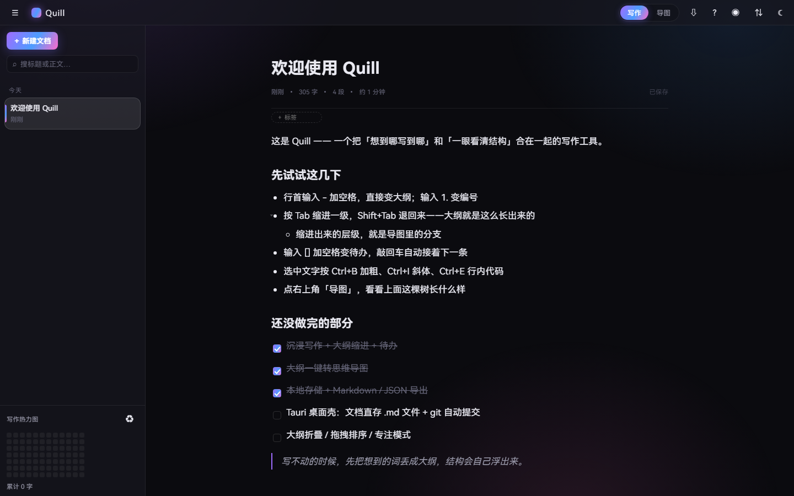
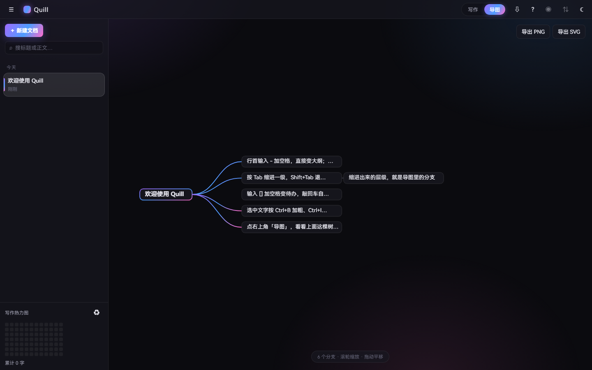

# Quill（羽笔）

一个类 Effie 的写作工具：**沉浸式写作 + 大纲层级 + 一键思维导图**，本地优先，文档用 git 做版本管理。

> **开发版 v0.1.0（pre-release）** — 功能已成形、日常写作可用，但接口与数据格式仍可能调整，暂不建议存放不可替代的重要资料。





<sub>亮色主题、折叠效果等更多截图见 [`docs/screenshots`](docs/screenshots)</sub>

## 现在能做什么

### 写作手感

| 能力 | 说明 |
|---|---|
| 沉浸写作 | 无工具栏干扰、720px 正文栏、大留白、可切亮/暗主题 |
| 大纲即正文 | `- ` / `1. ` / `[] ` 即时转换，Tab 缩进、Shift+Tab 退级 |
| 大纲折叠 | 有子列表的条目左侧出现三角，点击折叠/展开（状态随编辑位置映射，不会错位） |
| 块拖拽排序 | 抓住行首点阵手柄拖动，渐变落点线指示，可跨层级重排 |
| 斜杠命令 | 任意位置敲 `/` 唤起块类型菜单（11 种），带过滤与键盘导航 |
| 专注模式 | 只亮当前段落，其余淡出到 26% |
| 打字机模式 | 光标锁定视口偏上位置，滚动平滑跟随 |
| 待办列表 | 可勾选、可嵌套、输入 `[] ` 直接生成 |
| 富文本 | 标题 / 粗体 / 斜体 / 行内代码 / 高亮 / 引用 / 代码块 / 分隔线 |

### 组织与检索

| 能力 | 说明 |
|---|---|
| 文档模板 | 空白 / 日记 / 大纲草稿 / 读书笔记 / 会议记录 / 周报 |
| 全文搜索 | 标题 + 正文内容（正文命中会显示上下文片段） |
| 标签 | 编辑器里回车即加，侧栏 chip 一键筛选，文件改名时标签自动跟随 |
| 回收站 | 删除先移进 `.trash/`，可恢复 / 彻底删除 / 清空 |
| 收藏 | 星标置顶分组 |
| 写作热力图 | 侧栏底部 12 周 × 7 天，按当日字数分 4 级亮度 |
| 字数统计 | 字数 / 段数 / 预计阅读时长，保存状态呼吸提示 |

### 思维导图

- 大纲一键转导图（d3-hierarchy 算布局，自绘 SVG + 贝塞尔连线）
- 连线生长动画、节点逐个淡入
- 滚轮缩放（跟随鼠标）、拖动平移
- **点节点跳回正文**：切回写作视图并把光标精准落到那一段
- 导出 **PNG（2 倍图）** 与 **矢量 SVG**

### 数据与版本（核心）

- **一篇文章 = 一个纯 Markdown 文件**，没有私有数据库、没有专有格式
- **每次保存自动 git commit**：`更新《标题》`，改名走 rename（历史不断）
- 版本历史抽屉：列提交 → 预览旧版本内容 → 一键回滚（回滚本身也记一笔提交）
- 仓库位置：`%USERPROFILE%\Documents\Quill`，点顶栏 🗀 直接用资源管理器打开
- 导出 Markdown / JSON
- 元数据（星标 / 标签）存 `.quill-meta.json`，统计存 `.quill-stats.json`，都跟着 git 走

### 桌面集成

- Tauri 2 桌面壳（不是 Electron，体积小、内存低）
- **全局唤起快捷键 `Ctrl + Shift + Space`**：任意位置显示/隐藏窗口
- 深色窗口背景，避免启动白闪
- 提示系统：Toast 通知（保存失败 / 已回滚 / 已导出 / 模式切换）

### 交互细节

- 全套过渡动画：视图切换、文档列表 stagger 入场、按钮反馈、菜单弹出、抽屉滑入
- 弹窗式**快捷键面板**（`Ctrl + /`）
- `prefers-reduced-motion` 降级：系统关动效就不折腾你

## 快捷键

| 按键 | 作用 |
|---|---|
| `Ctrl + B` / `Ctrl + I` / `Ctrl + E` | 加粗 / 斜体 / 行内代码 |
| `Tab` / `Shift + Tab` | 缩进 / 退回一级 |
| `/` | 唤起块类型菜单 |
| `Ctrl + S` | 立即保存（平时 0.65 秒自动保存） |
| `Ctrl + N` | 新建文档 |
| `Ctrl + /` | 快捷键面板 |
| `Ctrl + \` | 收起 / 展开侧栏 |
| `Ctrl + Shift + Space` | 全局唤起窗口（桌面级） |

## 开发

```powershell
pnpm install
pnpm dev            # 开发服务器 http://localhost:5173
pnpm build          # 产出 dist/
pnpm typecheck      # 类型检查
pnpm tauri dev      # 桌面应用（需 Rust + MSVC，见 ../setup-tauri-env.ps1）
pnpm tauri build    # 出 exe + NSIS 安装包
```

## 验收

全部用 CDP 驱动无头 Edge 跑真实断言，而不是人肉点点看：

```powershell
node test-core.mjs         # Markdown 序列化 / 文件名安全化（10 项断言）
node verify-browser.mjs    # 基础渲染 + 排版 + 导图 + 截图
node verify-features.mjs   # 折叠 / 专注 / 打字机 / Toast / 正文搜索 / 侧栏动画
node verify-batch2.mjs     # 斜杠命令 / 模板 / 快捷键面板 / 导图导出
node verify-batch3.mjs     # 拖拽手柄 / 标签 / 回收站 / 热力图 / 导图跳转
```

截图落在 `.verify/`。环境变量：`APP_URL`、`APP_THEME=light`、`SHOT_PREFIX`、`CDP_PORT`。

## 目录结构

```
src/
  core/
    types.ts        文档模型（Doc / DocMeta）
    storage.ts      存储抽象接口 + IndexedDB 实现（浏览器调试用）
    storage-vault.ts 文件 + git 实现（Tauri 用），走 invoke 调 Rust 命令
    markdown.ts     Tiptap JSON → Markdown 序列化
    md-parse.ts     Markdown → Tiptap JSON（与序列化器严格对称）
    templates.ts    文档模板
    settings.ts     localStorage 小设置钩子
    time.ts         相对时间 / 列表分组
  editor/
    extensions.ts   Tiptap 扩展装配（Tab 缩进 / 折叠 / 专注淡化）
    drag.ts         块拖拽排序（widget 手柄 + 原生 DnD + 事务移动）
    EditorPane.tsx  编辑器 + 斜杠菜单 + 标签编辑 + 导图跳转定位
  ui/
    Sidebar.tsx     文档列表 + 搜索 + 标签筛选 + 热力图
    MindMap.tsx     导图（布局 / 交互 / 导出）
    HistoryDrawer.tsx 版本历史
    SlashMenu.tsx   斜杠命令
    ShortcutsPanel.tsx
    TrashPanel.tsx  回收站
    Heatmap.tsx
    ToastHost.tsx / toast.ts
  App.tsx           状态中枢
  style.css         设计系统 + 动效层
src-tauri/src/
  vault.rs          文件读写 / 回收站 / 标签 / 统计
  git.rs            git CLI 封装（init / commit / log / show / restore）
  lib.rs            命令注册 + 全局快捷键 + 窗口切换
```

## 设计决策

- **编辑器内核用 Tiptap（ProseMirror）**：中文 IME、撤销栈、粘贴过滤这些坑不值得自己踩。
- **文档以 Markdown 为唯一真相源**：序列化器手写，`.md` 干净可读、git diff 友好；
  反向解析器同样手写并与序列化器对称，换来零运行时依赖。
- **存储层抽象**：`DocStorage` 接口把「浏览器 IndexedDB」与「文件 + git」两套实现隔离，上层无感。
- **git 走系统 CLI 而非 libgit2**：行为和用户手敲 `git log` 完全一致，排查所见即所得；还省掉一套 C 构建链。
- **折叠状态用位置集合 + 事务位置映射**：在上面编辑时折叠不会错位，也不必把 UI 状态写进文档。
- **导图自绘 SVG**：d3-hierarchy 只算布局，渲染、交互、导出全部自己控制。
- **零运行时后端**：不依赖任何服务器，纯本地。

## 已知事项

- 生产 JS 单包约 674 kB（gzip 213 kB，主要是 Tiptap/ProseMirror）：可做代码分割，导图按需加载。
- 回收站里的文件也进 git（可恢复性的代价）；彻底删除后仍可从历史找回。
- 拖拽落点指示线在自动化（合成 DragEvent）下验不到，需真机确认。
- 首次构建需要 Rust 工具链 + MSVC 生成工具，一键脚本在仓库根目录 `../setup-tauri-env.ps1`。
